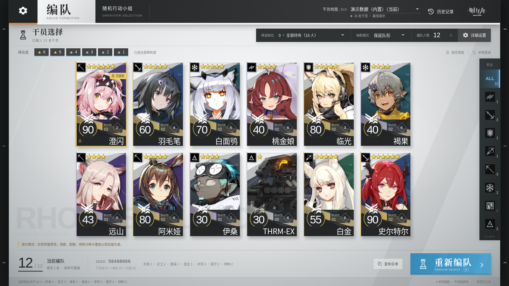
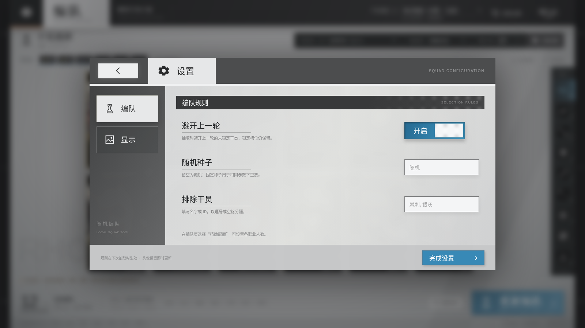

# 随机编队 · Roll Squad

《明日方舟》的一个本地小工具：从**你自己账号的干员池**里随机抽一队，换换花样玩。

练度、星级、职业配额、人数都能卡；抽签、配额、历史、职业、头像全在本地，**断网也能用**。



## 在线试用

**[pfmartist.github.io/roll-squad](https://pfmartist.github.io/roll-squad/)** —— 不用下载，打开就能抽：

- 干员池是**全游戏 429 名**可获取干员（游戏数据到 2026-09-04「石白深蓝之夜」，含女神异闻录3 Reload 联动）；
- 是**演示数据**：精英化与等级随机分配（好让六个档位筛出不同人数），不是你账号的干员池，也不写任何记录；
- **没有干员立绘**，卡片是职业色块 + 名字首字；
- 交互全是真的：开始编队、锁定 / 单格重抽、六个档位、星级、配额、职业竖栏都能点。

想抽自己的干员池，用下面的桌面版。

## 一、下载即用

去 **[Releases](https://github.com/PFMartist/roll-squad/releases/latest)** 下载
`roll-squad-v0.1.x-win64.zip`（约 21 MB），解压得到一个 `随机编队\` 文件夹，
双击里面的 `随机编队.exe` 就能用 —— **不用装任何东西，断网也能跑**：

```
随机编队\
├─ 随机编队.exe          前端资源已编进 exe（约 5.5 MB）
├─ 读我.txt
└─ data\                 与 exe 平级，整个文件夹就是它的"存档"
    ├─ config.json             记住你上次用的那套参数
    ├─ box_demo.json           示例干员池（见下）
    ├─ prts_professions.json   460 名干员的职业索引
    ├─ avatars.json + avatars\*.png   全量头像缓存（460 张，约 20 MB）
    └─ history.json            抽签历史（第一次抽签时自动生成）
```

整个文件夹可以随便拷（U 盘、别的电脑都行）。exe 没有代码签名，
Windows 可能弹「已保护你的电脑」——点**更多信息 → 仍要运行**即可。

## 二、换成自己的干员池（必看）

包里带的是 **`box_demo.json` —— 全图鉴示例池**（429 名干员），让你打开就能看见东西；
它**不是你账号的数据**，也不代表任何真实练度。

1. 在 MAA 里跑一次**干员识别**，导出 `OperBoxData.json`；
2. 改名成 `box_20260925.json` 这样（**必须以 `box` 开头、`.json` 结尾**）放进 `data\`；
3. 界面上方「干员档案 / BOX」下拉里选中它 —— 选择会写回 `config.json`，下次打开就是它。

干员池导出超过 14 天，BOX 徽章会变黄提醒你重新同步（练度会变）。

## 三、界面能做什么

| 控件 | 含义 |
|---|---|
| **筛选档位** | 6 档，越往下要求越高：0 全部持有 / 1 精一及以上 / 2 精一满级 / 3 精二 / 4 模组线 / 5 精二且 Lv≥80（下拉里直接显示每档人数） |
| **抽取模式** | 保底队形（先锋/医疗/重装各保底 1 名，其余随机）/ 纯随机 / 精确配额（八个职业逐个填人数） |
| **编队人数** | 1~12 |
| **稀有度** | ★1~★6 逐档勾选，一个都不勾会报错而不是静默抽空 |
| **随机种子** | 留空 = 每次都不一样；填数字 = 同参数下可重放 |
| **排除干员** | 写名字或 id，逗号/空格分隔 |
| **锁定 / 单格重抽** | 卡片上悬停出现：🔒 锁住这人不换，↻ 只换这一格 |
| **避开上一轮** | 默认开：本轮尽量不出现上一轮的人（锁定的仍保留） |
| **历史记录** | 点条目 = 用同一个种子重放那一队 |
| **头像开关** | 关掉后不再联网取图，头像退化成职业色块 |



- **档位 2「精一满级」和 4「模组线」按星级算**：精一满级 = 该星级的精英一上限
  （3★55 / 4★60 / 5★70 / 6★80），模组线 = 该星级开模组的门槛（4★40 / 5★50 / 6★60）。
  精二的干员一律算过「精一满级」——精英化会重置等级。
- **阿米娅**是全游戏唯一能转职的干员（术师/近卫/医疗）。配额凑不够时她会被顶上去，卡片上标「转职」。
- **新干员不用管**：职业索引里查不到的会联网现查一次，还是查不到就记「未知」，照常能抽，不会被剔除。
- **头像取过就留下**：同一张图只下一次，之后断网也有脸。
- **抽签本身从不联网**。

## 四、自己编译

需要 Rust stable ≥ 1.77 + MSVC 工具链，打包脚本还要 Python 3.10+。

```powershell
cd app\src-tauri
cargo build                      # 或 cargo run；开发时的数据在 app\devdata\

python app\package.py            # 打便携包 → dist\随机编队\
python app\package.py --no-avatars     # 不带头像缓存
python app\package.py --no-build       # 跳过 cargo build
```

打包前先关掉正在运行的 app —— exe 被占用会删不掉旧目录。

前端就是 `web\`：浏览器打开 `web\index.html?demo=1` 能看演示（内置全游戏干员、不联网），
改样式刷新即可，不用重新编译。`app\smoke-test.mjs` 是用调试端口驱动真应用的冒烟测试。

## 五、已知限制

- box 里没有技能等级与模组（MAA 导出不含这两项），所以工具不按它们筛。
- 新干员的头像要等 PRTS wiki 有人上传，没图时当场退化成职业色块（不影响抽签）。

## 六、素材与声明

- 干员名称、头像、职业图标、精英化徽章、LOGO 等素材版权归 **上海鹰角网络** 所有，
  取自 [PRTS wiki](https://prts.wiki)，仅用于非官方的个人工具。
- 本仓库**是非官方粉丝作品**，与鹰角网络无关；代码部分以 MIT 许可证发布（见 `LICENSE`），
  该许可**不覆盖**上述游戏素材。
